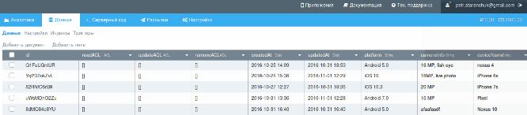
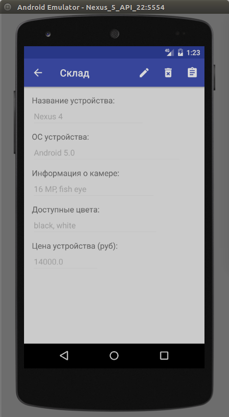

<a name="Storehouse"></a>

# "Storehouse" Application

This documentation includes description of the "Storehouse" application development process on the Scorocode platform as a demo. The application source code is available  in the following repository: <https://github.com/Scorocode/scorocode-sample-storehouse>.

The application is made to manage mobile phones stock inside a dealer storehouse and allows you to: 

1. Register a new user in the application database
2. Authenticate an application user
3. De-authenticate an application user
4. View available mobile phone models on stock in the storehouse  
5. Add a mobile phone model in the database
6. Delete a mobile phone model from the database
7. View full information about a mobile phone model
8. Change information about a mobile phone model
9. Select a certain mobile phone from a list using a filter
10. Add a user on the waiting list for this phone model
11. Ship this mobile phone model to the user
12. Notify the accounting department about the shipment using an email message
13. Notify a storehouse loading worker with a push message
14. Notify a courier with an sms message
15. Update the company's balance sheet taking into account the recent mobile phone shipment

## Application Data Structure.

Let's create the `storehouse` collection with the following fields:

1. platform (String)
2. cameraInfo (String)
3. deviceName (String)
4. colorsAvailable (Array)
5. devicePrice (Number)
6. buyers (Array)
7. lastSend (Date)
8. sendInfo (File)

We add 3 documents inside the system collection `Roles` with the following corresponding values for the `name` field:

1. deliveryPerson
2. accountantPerson
3. loaderPerson

## Application Launch Screen.

Let's create a launch screen for our application and call it `LoginActivity`. To do so we will go `File → New → Activity → Empty Activity` in Android Studio and add the following code in the layout file of the Activity:

```xml
<?xml version="1.0" encoding="utf-8"?>
<RelativeLayout xmlns:android="http://schemas.android.com/apk/res/android"
    xmlns:tools="http://schemas.android.com/tools"
    android:id="@+id/activity_login"
    android:layout_width="match_parent"
    android:layout_height="match_parent"
    android:paddingBottom="@dimen/activity_vertical_margin"
    android:paddingLeft="@dimen/activity_horizontal_margin"
    android:paddingRight="@dimen/activity_horizontal_margin"
    android:paddingTop="@dimen/activity_vertical_margin"
    tools:context="prof_itgroup.ru.storehouseapp.Activities.LoginActivity">
    <LinearLayout
        android:layout_width="match_parent"
        android:layout_height="wrap_content"
        android:gravity="center"
        android:orientation="vertical">
        <TextView
            style="@style/label_style"
            android:layout_marginTop="16dp"
            android:text="@string/login" />
        <EditText
            android:id="@+id/etEmail"
            android:gravity="center"
            style="@style/textStyle"
            android:hint="@string/login_hint" />
        <TextView
            style="@style/label_style"
            android:layout_marginTop="16dp"
            android:text="@string/password"/>
        <EditText
            android:gravity="center"
            android:id="@+id/etPassword"
            style="@style/textStyle"
            android:hint="@string/password_hint"
            android:inputType="textPassword"
            android:maxLines="1" />
        <LinearLayout
            android:layout_width="wrap_content"
            android:layout_height="wrap_content"
            android:gravity="center_horizontal"
            android:orientation="vertical">
            <Button
                android:id="@+id/btnLogin"
                android:layout_width="match_parent"
                android:layout_height="wrap_content"
                android:layout_marginTop="4dp"
                android:text="@string/login_button_text" />
            <Button
                android:id="@+id/btnRegister"
                android:layout_width="match_parent"
                android:layout_height="wrap_content"
                android:layout_marginTop="4dp"
                android:text="@string/register_button_text" />
        </LinearLayout>
    </LinearLayout>
</RelativeLayout>
```
The launch screen of the `LoginActivity` class is shown in Figure 1.1. 


Figure 1.1 – application launch screen.

Let's add the following code lines in the `onCreate` method of the `LoginActivity` class:

```Java
@Override
protected void onCreate(Bundle savedInstanceState) {
    super.onCreate(savedInstanceState);
    setContentView(R.layout.activity_login);
    if (isUserLogined(this)) {
        MainActivity.display(this);
    }
    ScorocodeSdk.initWith(APPLICATION_ID, CLIENT_KEY, null, FILE_KEY, MESSAGE_KEY, SCRIPT_KEY, null);
    ButterKnife.bind(this);
}
```

`ScorocodeSdk` initialization is happening in the `onCreate` method with keys `appId`, `clientKey` (android), `fileKey`, `messageKey`, `scriptKey` using the `ScorocodeSdk.initWith(...)` method. These keys can be viewed at the «Security» tab in the project Settings.

On this screen, a database user can enter their system login and password. The application will check whether they are correct using the `.login()` method of the `User` class. This method is demonstrated in a listing:

```Java
@OnClick(R.id.btnLogin)
public void onBtnLoginClicked() {
    User user = new User();
    user.login(etEmail.getText().toString(), etPassword.getText().toString(), new CallbackLoginUser() {
        @Override
        public void onLoginSucceed(ResponseLogin responseLogin) {
            DocumentInfo userInfo = responseLogin.getResult().getUserInfo();
            saveUserInfo(userInfo);
            MainActivity.display(LoginActivity.this);
        }
        @Override
        public void onLoginFailed(String errorCode, String errorMessage) {
            Helper.showToast(getBaseContext(), R.string.error_login);
        }
    });
}
```

In this method, we create a new sample of the `User` class and run its `login` method. The information about a user's email and password is taken from the corresponding `EditText`. The `login` method will check that a user with this email and this password exists in the «users» collection.

In case such user exists in the «users» collection, the `onLoginSucceed(...) callback` method will be executed. Otherwise it the `onFoginFailed(...)` method that will be executed. Thus, we can be sure whether such user exists in our database and act accordingly.

On the launch screen (see illustration 1.1) we also have the «Register» button which allows to register a new user in the system (add to the «users» database collection). Let's connect this button to the button click handler which opens an Activity with user's data needed for registration:

```Java
@OnClick(R.id.btnRegister)
public void onBtnRegisterClicked() {
    RegisterActivity.display(this);
}
``` 

## New User Registration Screen.

Let's create an new Activity called `RegisterActivity` and add the following xml code in the layout file of this Activity:

```xml
<?xml version="1.0" encoding="utf-8"?>
<LinearLayout xmlns:android="http://schemas.android.com/apk/res/android"
    xmlns:tools="http://schemas.android.com/tools"
    android:id="@+id/activity_register"
    android:layout_width="match_parent"
    android:layout_height="match_parent"
    android:gravity="center_horizontal"
    android:orientation="vertical"
    android:paddingBottom="@dimen/activity_vertical_margin"
    android:paddingLeft="@dimen/activity_horizontal_margin"
    android:paddingRight="@dimen/activity_horizontal_margin"
    android:paddingTop="@dimen/activity_vertical_margin"
    tools:context="prof_itgroup.ru.storehouseapp.Activities.RegisterActivity">
    <TextView
        style="@style/label_style"
        android:text="@string/register_username" />
    <EditText
        android:id="@+id/etUsername"
        style="@style/textStyle"
        android:hint="@string/register_username_hint"/>
    <TextView
        android:layout_marginTop="16dp"
        style="@style/label_style"
        android:text="@string/register_email" />
    <EditText
        android:id="@+id/etEmail"
        style="@style/textStyle"
        android:hint="@string/register_email_hint"/>
    <TextView
        android:layout_marginTop="16dp"
        style="@style/label_style"
        android:text="@string/register_password" />
    <EditText
        android:id="@+id/etPassword"
        style="@style/textStyle"
        android:inputType="textPassword"
        android:hint="@string/register_email_password"/>
    <EditText
        android:id="@+id/etPasswordCheck"
        style="@style/textStyle"
        android:inputType="textPassword"
        android:hint="@string/register_email_password_again"/>
    <Button
        android:layout_marginTop="32dp"
        android:id="@+id/btnRegister"
        style="@style/textStyle"
        android:text="@string/btn_register_text"/>
</LinearLayout>
```
This Activity is a new user registration screen, as shown in Figure 1.2


Figure 1.2 — a new user registration screen.

All document fields needed for a user registration are listed on this screen. Let's add the button click event handler for the «Register» button which will run the `.register` method of the `User` class, as shown below:

```Java
@OnClick(R.id.btnRegister)
public void onBtnRegisterClicked() {
    String userName = etUsername.getText().toString();
    String email = etEmail.getText().toString();
    String password = etPassword.getText().toString();
    String passwordCheck = etPasswordCheck.getText().toString();

    if(isInputValid(userName, email, password, passwordCheck)) {
        new User().register(userName, email, password, new CallbackRegisterUser() {
            @Override
            public void onRegisterSucceed() {
                Toast.makeText(RegisterActivity.this, getResources().getString(R.string.register_succeed), Toast.LENGTH_SHORT).show();
                LoginActivity.display(RegisterActivity.this);
            }
            @Override
            public void onRegisterFailed(String errorCode, String errorMessage) {
                Toast.makeText(RegisterActivity.this, getResources().getString(R.string.error_register), Toast.LENGTH_SHORT).show();
            }
        });
    } else {
        Toast.makeText(this, getResources().getString(R.string.wrong_data) , Toast.LENGTH_SHORT).show();
    }
}
```

In this method, we get values entered in the `EditText` elements, e.g.: a user name, their email, password and repeated password (for a check).

Then using the isInputValid method we check that the fields are not left empty and that the values, entered into the two password fields are identical. Afterwards, we can run the `.register` method of the `User` class.

In case the user registration was a success (i.e. if the SDK is initiated, all keys are correct and there is no conflict with existing users), the interface `onRegisterSucceed(...) callback` method will be executed. Otherwise it is the `onRegisterFailed(...)` method that will be executed.

In this case, if the registration is a success, a Toast message will be shown with a note that the user is registered. Then the `LoginActivity` activity begins so that the user can log in and start working with the application.

## Application Main Screen.

Let's create the application main page called `MainActivity` and add the following xml code in the layout file of this Activity:

```xml
<?xml version="1.0" encoding="utf-8"?>
<RelativeLayout
    xmlns:android="http://schemas.android.com/apk/res/android"
    xmlns:tools="http://schemas.android.com/tools"
    android:id="@+id/activity_main"
    android:layout_width="match_parent"
    android:layout_height="match_parent"
    android:paddingLeft="@dimen/activity_horizontal_margin"
    android:paddingRight="@dimen/activity_horizontal_margin"
    android:paddingTop="@dimen/activity_vertical_margin"
    android:paddingBottom="@dimen/activity_vertical_margin"
    tools:context="prof_itgroup.ru.storehouseapp.Activities.MainActivity">
    <ListView
        android:id="@+id/lvItemsInStorehouse"
        android:layout_width="match_parent"
        android:layout_height="wrap_content"/>
</RelativeLayout>
```

This is the `ListView` Activity which we fill with the data about goods stored in the database. In addition, the Activity contains `ActionBar` icons. We will talk about them in some detail later on. 

Let's create an adapter called `StoreItemAdapter` to show us the data with the following code: 

```Java
package prof_itgroup.ru.storehouseapp.Objects;
import android.content.Context;
import android.support.annotation.NonNull;
import android.view.LayoutInflater;
import android.view.View;
import android.view.ViewGroup;
import android.widget.BaseAdapter;
import android.widget.TextView;
import java.util.List;
import butterknife.BindView;
import butterknife.ButterKnife;
import prof_itgroup.ru.storehouseapp.Activities.ItemDetailsActivity;
import prof_itgroup.ru.storehouseapp.R;
import ru.profit_group.scorocode_sdk.scorocode_objects.DocumentInfo;
 
public class StoredItemsAdapter extends BaseAdapter {
    private Context context;
    private List<DocumentInfo> storedItems;
    private int layoutId;
    private LayoutInflater inflater;
    private DocumentFields fields;
    public StoredItemsAdapter(Context context, @NonNull List<DocumentInfo> storedItems, int layoutId) {
        this.context = context;
        this.storedItems = storedItems;
        this.layoutId = layoutId;
        inflater = LayoutInflater.from(context);
        fields = new DocumentFields(context, null);
    }
    @Override
    public int getCount() {
        return storedItems.size();
    }
    @Override
    public Object getItem(int position) {
        return storedItems.get(position);
    }
    @Override
    public long getItemId(int position) {
        return position;
    }
    @Override
    public View getView(int position, View view, ViewGroup parent) {
        ViewHolder holder;
        if (view != null) {
            holder = (ViewHolder) view.getTag();
        } else {
            view = inflater.inflate(layoutId, parent, false);
            holder = new ViewHolder(view);
            view.setTag(holder);
        }
        customizeView(view, holder, storedItems.get(position));
        return view;
    }
    private void customizeView(View view, ViewHolder holder, final DocumentInfo documentInfo) {
        String deviceName = (String) documentInfo.getFields().get(fields.getDeviceNameField());
        String devicePlatform = (String) documentInfo.getFields().get(fields.getPlatformField());
        Double devicePrice = (Double) documentInfo.getFields().get(fields.getDevicePriceField());
        holder.tvStoredItemName.setText(deviceName);
        holder.tvStoredItemStatus.setText(devicePlatform);
        holder.tvStoredItemPrice.setText(String.valueOf(devicePrice));
        view.setOnClickListener(new View.OnClickListener() {
            @Override
            public void onClick(View v) {
                ItemDetailsActivity.display(context, documentInfo);
            }
        });
    }
    static class ViewHolder {
        @BindView(R.id.tvStoredItemName) TextView tvStoredItemName;
        @BindView(R.id.tvStoredItemPlatform) TextView tvStoredItemStatus;
        @BindView(R.id.tvStoredItemPrice) TextView tvStoredItemPrice;
        public ViewHolder(View view) {
            ButterKnife.bind(this, view);
        }
    }
}
```

We will use the following layout file as a list element:

```xml
 <?xml version="1.0" encoding="utf-8"?>
<RelativeLayout xmlns:android="http://schemas.android.com/apk/res/android"
    android:layout_width="match_parent"
    android:layout_height="match_parent"
    android:orientation="horizontal"
    android:padding="8dp">
    <TextView
        android:id="@+id/tvStoredItemName"
        style="@style/textStyle"
        android:layout_alignParentLeft="true"
        android:layout_toLeftOf="@+id/tvStoredItemPlatform"
        android:text="@string/storedItemName" />
    <TextView
        android:id="@+id/tvStoredItemPlatform"
        style="@style/textStyle"
        android:layout_marginRight="32dp"
        android:layout_toLeftOf="@+id/tvStoredItemPrice"
        android:text="@string/storedItemStatus" />
    <TextView
        android:id="@+id/tvStoredItemPrice"
        style="@style/textStyle"
        android:layout_alignParentRight="true"
        android:text="@string/storedItemPrice" />
</RelativeLayout>
```

We will get the data about stored goods in the `onResume()` method of the `MainActivity`Activity. For this let's add the following code lines in the `onResume` method:

```Java
@Override
protected void onResume() {
    super.onResume();
    Query query = new Query(COLLECTION_NAME);
    query.findDocuments(new CallbackFindDocument() {
        @Override
        public void onDocumentFound(List<DocumentInfo> documentInfos) {
            if(documentInfos != null) {
                setAdapter(documentInfos);
            }
        }
        @Override
        public void onDocumentNotFound(String errorCode, String errorMessage) {
            Toast.makeText(MainActivity.this, getResources().getString(R.string.error_get_docs), Toast.LENGTH_SHORT).show();
        }
    });
}
```

In this code we create a `Query` object sample without setting any parameters (i.e. we choose the first 100 documents from this collection) and then we get the documents from our collection with the `findDocument` method.

In case we were successful in finding the documents, we install the adapter. Otherwise, we transmit the error message.

Let's also add the icons we need in the `ActionBar` Activity. For this, we will create the `main_activity_menu` layout file and add the following xml code:

```xml
<menu xmlns:android="http://schemas.android.com/apk/res/android"
    xmlns:app="http://schemas.android.com/apk/res-auto">
    <item
        android:id="@+id/action_add_item"
        android:icon="@drawable/ic_create_new_folder_white_24dp"
        android:title="@string/action_add_item"
        app:showAsAction="always"/>
    <item
        android:id="@+id/action_set_filter"
        android:icon="@drawable/ic_filter_list_white_24dp"
        android:title="@string/action_filter_item"
        app:showAsAction="ifRoom"/>
    <item
        android:id="@+id/action_logout"
        android:icon="@drawable/ic_exit_to_app_white_24dp"
        android:title="@string/action_logout_item"
        app:showAsAction="ifRoom"/>
    
</menu>
```

This means that we will show icons "Add an item to the database", "Set a filter" and "Logout" in the  `ActionBar`. We can add these icons to the activity screen with the following code lines:

```Java
@Override
public boolean onCreateOptionsMenu(Menu menu) {
    getMenuInflater().inflate(R.menu.main_activity_menu, menu);
    return super.onCreateOptionsMenu(menu);
}
```

We will handle icons clicks with the method described below:

```Java
@Override
public boolean onOptionsItemSelected(MenuItem item) {
    switch (item.getItemId()) {
        case R.id.action_add_item:
            AddItemActivity.display(this);
            break;

        case R.id.action_set_filter:
            new FilterDialog(this).showFilterDialog(new FilterDialog.CallbackFilterDialog() {
                @Override
                public void onFilterApplied(List<DocumentInfo> documentInfo) {
                    setAdapter(documentInfo);
                }
            });
            break;

        case R.id.action_logout:
            LoginActivity.logout(this);
            break;
    }
    return super.onOptionsItemSelected(item);
}
```

The completed screen for this activity is shown in Figure 2.1


Figure 2.1 — main application screen

On this screen, we can see available mobile phone models which are kept in our storehouse. The following icons are shown in the right upper corner:

 - Add new item (mobile phone model) to the database.


 - Apply a filter to the list of items.

	   
 - End an active session (logout).	

After clicking on the  button, a user switches to the item adding screen of the application. 

## Add an Item Screen

Let's create an Acitivity called `AddItemActivity` and add the folowing xml code to its layout file:

```xml
<?xml version="1.0" encoding="utf-8"?>
<LinearLayout xmlns:android="http://schemas.android.com/apk/res/android"
    xmlns:tools="http://schemas.android.com/tools"
    android:id="@+id/activity_add_item"
    android:layout_width="match_parent"
    android:layout_height="match_parent"
    android:orientation="vertical"
    android:padding="8dp"
    tools:context="prof_itgroup.ru.storehouseapp.Activities.AddItemActivity">
    <ScrollView
        android:layout_width="match_parent"
        android:layout_height="wrap_content">
        <include layout="@layout/item_core"/>
    </ScrollView>
</LinearLayout>
```

In turn, the activated item_core.xml file represents of the following lines:

```xml
<LinearLayout android:layout_width="match_parent"
    android:layout_height="wrap_content"
    android:orientation="vertical"
    xmlns:android="http://schemas.android.com/apk/res/android">
    <TextView
        style="@style/label_style"
        android:text="@string/add_item_device_name" />
    <EditText
        android:id="@+id/etDeviceName"
        style="@style/textStyle"
        android:hint="@string/add_item_hint_device_name" />
    <TextView
        style="@style/label_style"
        android:text="@string/add_item_device_platform" />
    <EditText
        android:id="@+id/etDevicePlatform"
        style="@style/textStyle"
        android:hint="@string/add_item_hint_device_platform" />
    <TextView
        style="@style/label_style"
        android:text="@string/add_item_camera_info" />
    <EditText
        android:id="@+id/etDeviceCameraInfo"
        style="@style/textStyle"
        android:hint="@string/add_item_hint_camera_info" />
    <TextView
        style="@style/label_style"
        android:text="@string/add_item_available_colors_info" />
    <EditText
        android:id="@+id/etDeviceColors"
        style="@style/textStyle"
        android:hint="@string/add_item_hint_available_colors_info" />
    <LinearLayout
        android:id="@+id/llChangeColorList"
        android:visibility="gone"
        android:gravity="center_horizontal"
        android:orientation="horizontal"
        android:layout_width="match_parent"
        android:layout_height="wrap_content">
        <Button
            android:id="@+id/btnAddColor"
            android:padding="12dp"
            android:layout_marginRight="8dp"
            android:text="@string/add_color"
            android:layout_width="wrap_content"
            android:layout_height="wrap_content" />
        <Button
            android:id="@+id/btnRemoveColor"
            android:padding="12dp"
            android:layout_marginLeft="8dp"
            android:text="@string/remove_color"
            android:layout_width="wrap_content"
            android:layout_height="wrap_content" />
    </LinearLayout>
    <TextView
        style="@style/label_style"
        android:text="@string/add_item_price" />
    <EditText
        android:id="@+id/etDevicePrice"
        style="@style/textStyle"
        android:inputType="number"
        android:hint="@string/add_item_hint_available_amount_info" />
    <LinearLayout
        android:id="@+id/llChangePrice"
        android:visibility="gone"
        android:gravity="center_horizontal"
        android:orientation="horizontal"
        android:layout_width="match_parent"
        android:layout_height="wrap_content">
        <Button
            android:id="@+id/btnIncreaseCount"
            android:padding="8dp"
            android:layout_marginRight="8dp"
            android:text="@string/increase_item_count"
            android:layout_width="wrap_content"
            android:layout_height="wrap_content" />
        <Button
            android:id="@+id/btnDecreaseCount"
            android:padding="8dp"
            android:layout_marginLeft="8dp"
            android:text="@string/decrease_item_count"
            android:layout_width="wrap_content"
            android:layout_height="wrap_content" />
    </LinearLayout>
    <LinearLayout
        android:orientation="vertical"
        android:gravity="center"
        android:layout_gravity="center"
        android:layout_width="200dp"
        android:layout_height="wrap_content"
        android:weightSum="1">
        <Button
            android:id="@+id/btnAddItem"
            android:padding="8dp"
            android:background="#64b5f6"
            android:textColor="@android:color/white"
            android:layout_width="match_parent"
            android:layout_height="wrap_content"
            android:layout_gravity="center_horizontal"
            android:layout_marginTop="8dp"
            android:text="@string/add" />
        <Button
            android:id="@+id/btnClear"
            android:padding="8dp"
            android:background="#64b5f6"
            android:textColor="@android:color/white"
            android:layout_width="match_parent"
            android:layout_height="wrap_content"
            android:layout_gravity="center_horizontal"
            android:layout_marginTop="8dp"
            android:text="@string/button_clear"
            android:layout_weight="0.22" />
    </LinearLayout>
</LinearLayout>
```

The final activity screen is shown in Fugure 2.2


Figure 2.2 — Add an Item screen.


On this screen, a user enters all necessary information about the device (item) and presses on the «ADD» button. With this, the program creates a new document, fills its fields and saves on a server. Let's add the following activities: defining a click handler for the «ADD» button which will run the method described below:

```Java
@OnClick(R.id.btnAddItem)
public void onBtnAddItemClicked() {
    Document document = new Document(MainActivity.COLLECTION_NAME);
    if (isAllFieldsFilled()) {
        document.setField(fields.getDeviceNameField(), getStringFrom(etDeviceName).trim());
        document.setField(fields.getPlatformField(), getStringFrom(etDevicePlatform).trim());
        document.setField(fields.getCameraInfoField(), getStringFrom(etDeviceCameraInfo).trim());
        document.setField(fields.getColorsAvailableField(), getColorsListFrom(getStringFrom(etDeviceColors)));
        document.setField(fields.getDevicePriceField(), Double.valueOf(getStringFrom(etDevicePrice)));
        document.saveDocument(new CallbackDocumentSaved() {
            @Override
            public void onDocumentSaved() {
                Toast.makeText(AddItemActivity.this, getString(R.string.succed_add_item), Toast.LENGTH_SHORT).show();
                finish();
            }

            @Override
            public void onDocumentSaveFailed(String errorCode, String errorMessage) {
                Toast.makeText(AddItemActivity.this, getString(R.string.error_add_item), Toast.LENGTH_SHORT).show();
            }
        });
    } else {
        Toast.makeText(this, getString(R.string.wrong_data), Toast.LENGTH_SHORT).show();
    }
}
```

In this method we create a sample of the `Document` class, check whether a user has provided all necessary information in the corresponding `EditText` fields and set the document fields with the `setField(…)` method. Then we save the document. Since the document was created without a connection with a real document form the database (i.e. without using the `getDocumentById()` method), the new created document with the set fields will be uploaded to a server.

Documents are stored in the Scorocode database as shown on Figure 2.3



Figure 2.3 — storing documents in the Scorocode database.

Each document contains system and user's fields.
System fields are:

1. id — unique document ID in the collection.
2. readACL — permission to read this document.
3. updateACL — permission to update this document.
4. removeACL — permission to delete this document.
5. createdAt — time of the document creation.
6. updatedAt - time of the document last update.

A user can add other fields at their discretion with the «Add a field» button in the upper panel. They can also add a document with the «Add a document» button in the upper panel and enter data in the fields manually. For more information on the database upper panel features, please, see Scorocode documentation.

When clicking on the  button a user enter the filter dialog screen.

Let's create this filter dialog screen. For this, we need to create the `FilterDialog` class using the following code:

```Java
package prof_itgroup.ru.storehouseapp.Objects;
import android.content.Context;
import android.content.DialogInterface;
import android.support.v7.app.AlertDialog;
import android.view.LayoutInflater;
import android.view.View;
import android.widget.CheckBox;
import android.widget.EditText;
import java.util.ArrayList;
import java.util.Arrays;
import java.util.List;
import butterknife.ButterKnife;
import prof_itgroup.ru.storehouseapp.Activities.MainActivity;
import prof_itgroup.ru.storehouseapp.Helpers.Helper;
import prof_itgroup.ru.storehouseapp.R;
import ru.profit_group.scorocode_sdk.Callbacks.CallbackFindDocument;
import ru.profit_group.scorocode_sdk.scorocode_objects.DocumentInfo;
import ru.profit_group.scorocode_sdk.scorocode_objects.Query;
 
public class FilterDialog {
    private Context context;
    public FilterDialog(Context context) {
        this.context = context;
    }
    public void showFilterDialog(final CallbackFilterDialog callbackFilterDialog) {
        final View v = LayoutInflater.from(context).inflate(R.layout.filter_layout, null);
        final CheckBox cbPriceFilter = ButterKnife.findById(v, R.id.cbPriceFilter);
        final CheckBox cbPlatformFilter = ButterKnife.findById(v, R.id.cbPlatformFilter);
        final CheckBox cbColourFilter = ButterKnife.findById(v, R.id.cbColorFilter);
        final EditText etPlatformFilter = ButterKnife.findById(v, R.id.etPlatformFilter);
        final EditText etColors = ButterKnife.findById(v, R.id.etColors);
        AlertDialog.Builder builder = new AlertDialog.Builder(context)
                .setTitle(R.string.titleChooseFilterProperties)
                .setPositiveButton(R.string.continue_action, new DialogInterface.OnClickListener() {
                    @Override
                    public void onClick(DialogInterface dialog, int which) {
                        Query query = new Query(MainActivity.COLLECTION_NAME);
                        if (cbPriceFilter.isChecked()) {
                            setPriceFilter(v, query);
                        }
                        if (cbPlatformFilter.isChecked()) {
                            query.equalTo(new DocumentFields(context).getPlatformField(), etPlatformFilter.getText().toString());
                        }
                        if(cbColourFilter.isChecked()) {
                            List<Object> colors = new ArrayList<>();
                            colors.addAll(Arrays.asList(Helper.getStringFrom(etColors).split(",")));
                            query.containedIn(new DocumentFields(context).getColorsAvailableField(), colors);
                        }
                        query.findDocuments(new CallbackFindDocument() {
                            @Override
                            public void onDocumentFound(List<DocumentInfo> documentInfos) {
                                 callbackFilterDialog.onFilterApplied(documentInfos);
                            }
                            @Override
                            public void onDocumentNotFound(String errorCode, String errorMessage) {
                                Helper.showToast(context, R.string.error);
                            }
                        });
                    }
                }).setView(v);
        builder.show();
    }
    private void setPriceFilter(View view, Query query) {
        String priceField = new DocumentFields(view.getContext()).getDevicePriceField();
        final CheckBox cbIncludeLower = ButterKnife.findById(view, R.id.cbIncludeLower);
        final CheckBox cbIncludeUpper = ButterKnife.findById(view, R.id.cbIncludeUpper);
        final EditText etLowerPrice = ButterKnife.findById(view, R.id.etPriceFrom);
        final EditText etUpperPrice = ButterKnife.findById(view, R.id.etPriceTo);
        if(cbIncludeLower.isChecked()) {
            query.greaterThenOrEqualTo(priceField, getPrice(etLowerPrice));
        } else {
            query.greaterThan(priceField, getPrice(etLowerPrice));
        }
        if(cbIncludeUpper.isChecked()) {
            query.lessThanOrEqualTo(priceField, getPrice(etUpperPrice));
        } else {
            query.lessThan(priceField, getPrice(etUpperPrice));
        }
    }
    private Double getPrice(EditText etPrice) {
        String price = etPrice.getText().toString();
        Double priceDouble = 0d;
        if(!price.isEmpty()) {
            priceDouble = Double.valueOf(price);
        }
        return priceDouble;
    }
    public interface CallbackFilterDialog {
        void onFilterApplied(List<DocumentInfo> documentInfo);
    }
}
```

In the `showFilterDialog` method we create `AlertDialog` and set its `View` from the following layout file:

```xml
 <?xml version="1.0" encoding="utf-8"?>
<LinearLayout xmlns:android="http://schemas.android.com/apk/res/android"
    android:orientation="vertical"
    android:padding="16dp"
    android:layout_width="match_parent"
    android:layout_height="match_parent">
    <include layout="@layout/price_filter_layout" />

    <include layout="@layout/dilimeter" />

    <include layout="@layout/platform_filter" />

    <include layout="@layout/dilimeter" />

    <LinearLayout
        android:orientation="horizontal"
        android:layout_width="match_parent"
        android:layout_height="wrap_content">
        <CheckBox
            android:id="@+id/cbColorFilter"
            android:layout_width="wrap_content"
            android:layout_height="wrap_content" />
        <TextView
            android:text="@string/colorsFilter"
            style="@style/label_style"/>
        <EditText
            android:id="@+id/etColors"
            android:layout_marginLeft="16dp"
            android:hint="@string/color_filter_hint"
            style="@style/label_style" />
    </LinearLayout>
</LinearLayout>
```

The layout files `price_filter_layout` and `platform_filter` are shown below:

```xml
<?xml version="1.0" encoding="utf-8"?>
<LinearLayout xmlns:android="http://schemas.android.com/apk/res/android"
    xmlns:tools="http://schemas.android.com/tools"
    android:orientation="vertical"
    android:layout_width="match_parent"
    android:layout_height="wrap_content"
    tools:showIn="@layout/filter_layout">
    <LinearLayout
        android:orientation="horizontal"
        android:layout_width="match_parent"
        android:layout_height="wrap_content">
        <CheckBox
            android:id="@+id/cbPriceFilter"
            android:layout_width="wrap_content"
            android:layout_height="wrap_content" />
        <TextView
            android:layout_marginLeft="8dp"
            android:layout_marginStart="8dp"
            android:text="@string/filter_price_from"
            style="@style/label_style" />
        <EditText
            android:id="@+id/etPriceFrom"
            android:layout_marginLeft="4dp"
            android:layout_marginStart="4dp"
            android:minWidth="60dp"
            android:layout_width="wrap_content"
            android:layout_height="wrap_content" />
        <TextView
            android:text="@string/filter_price_up_to"
            android:layout_width="wrap_content"
            android:layout_height="wrap_content" />
        <EditText
            android:id="@+id/etPriceTo"
            android:layout_marginLeft="4dp"
            android:layout_marginStart="4dp"
            android:minWidth="60dp"
            style="@style/label_style"/>
    </LinearLayout>
    <RelativeLayout
        android:layout_width="match_parent"
        android:layout_height="wrap_content">
        <LinearLayout
            android:id="@+id/llLowerBound"
            android:layout_marginLeft="32dp"
            android:layout_alignParentLeft="true"
            android:orientation="horizontal"
            android:layout_width="wrap_content"
            android:layout_height="wrap_content">
            <CheckBox
                android:id="@+id/cbIncludeLower"
                android:layout_width="wrap_content"
                android:layout_height="wrap_content" />
            <TextView
                android:layout_gravity="fill"
                android:text="@string/include_lower"
                style="@style/label_style" />
        </LinearLayout>
        <LinearLayout
            android:layout_marginLeft="160dp"
            android:orientation="horizontal"
            android:layout_width="wrap_content"
            android:layout_height="wrap_content">
            <CheckBox
                android:id="@+id/cbIncludeUpper"
                android:layout_width="wrap_content"
                android:layout_height="wrap_content" />
            <TextView
                android:layout_gravity="fill"
                android:text="@string/include_upper"
                style="@style/label_style" />
        </LinearLayout>
    </RelativeLayout>
</LinearLayout>
```

```xml
<?xml version="1.0" encoding="utf-8"?>
<LinearLayout xmlns:android="http://schemas.android.com/apk/res/android"
    xmlns:tools="http://schemas.android.com/tools"
    android:orientation="horizontal"
    android:layout_width="wrap_content"
    android:layout_height="wrap_content"
    tools:showIn="@layout/filter_layout">
    <CheckBox
        android:id="@+id/cbPlatformFilter"
        android:layout_width="wrap_content"
        android:layout_height="wrap_content" />
    <TextView
        android:layout_marginLeft="8dp"
        android:layout_marginStart="8dp"
        android:text="@string/filter_platform"
        style="@style/label_style" />
    <EditText
        android:id="@+id/etPlatformFilter"
        android:layout_marginLeft="4dp"
        android:layout_marginStart="4dp"
        android:minWidth="60dp"
        android:layout_width="wrap_content"
        android:layout_height="wrap_content" />
</LinearLayout>
```

The filter dialog screen is shown in Figure 2.4


Figure 2.4 — filter dialog screen.

On this dialog screen, a user can specify database sample criteria as follows:
* Device price
* Device platform (Android or iOS, plus operation system version number).
* Available colours.

When pressing the «Continue» button, we check whether the CheckBox elements were chosen and, if yes, we set the corresponding filter.

Code listing for setting a filter:  

```Java
public void showFilterDialog(final CallbackFilterDialog callbackFilterDialog) {
    final View v = LayoutInflater.from(context).inflate(R.layout.filter_layout, null);
    final CheckBox cbPriceFilter = ButterKnife.findById(v, R.id.cbPriceFilter);
    final CheckBox cbPlatformFilter = ButterKnife.findById(v, R.id.cbPlatformFilter);
    final CheckBox cbColourFilter = ButterKnife.findById(v, R.id.cbColorFilter);
    final EditText etPlatformFilter = ButterKnife.findById(v, R.id.etPlatformFilter);
    final EditText etColors = ButterKnife.findById(v, R.id.etColors);
    
    AlertDialog.Builder builder = new AlertDialog.Builder(context)
            .setTitle(R.string.titleChooseFilterProperties)
            .setPositiveButton(R.string.continue_action, new DialogInterface.OnClickListener() {
                @Override
                public void onClick(DialogInterface dialog, int which) {
                    Query query = new Query(MainActivity.COLLECTION_NAME);
                    if (cbPriceFilter.isChecked()) {
                        setPriceFilter(v, query);
                    }
    
                    if (cbPlatformFilter.isChecked()) {
                        query.equalTo(new DocumentFields(context).getPlatformField(), etPlatformFilter.getText().toString());
                    }
    
                    if(cbColourFilter.isChecked()) {
                        List<Object> colors = new ArrayList<>();
                        colors.addAll(Arrays.asList(Helper.getStringFrom(etColors).split(",")));
                        query.containedIn(new DocumentFields(context).getColorsAvailableField(), colors);
                    }
                    query.findDocuments(new CallbackFindDocument() {
                        @Override
                        public void onDocumentFound(List<DocumentInfo> documentInfos) {
                             callbackFilterDialog.onFilterApplied(documentInfos);
                        }
                        @Override
                        public void onDocumentNotFound(String errorCode, String errorMessage) {
                            Helper.showToast(context, R.string.error);
                        }
                    });
                }
            }).setView(v);
    builder.show();
}

private void setPriceFilter(View view, Query query) {
    String priceField = new DocumentFields(view.getContext()).getDevicePriceField();
    final CheckBox cbIncludeLower = ButterKnife.findById(view, R.id.cbIncludeLower);
    final CheckBox cbIncludeUpper = ButterKnife.findById(view, R.id.cbIncludeUpper);
    final EditText etLowerPrice = ButterKnife.findById(view, R.id.etPriceFrom);
    final EditText etUpperPrice = ButterKnife.findById(view, R.id.etPriceTo);
    if(cbIncludeLower.isChecked()) {
        query.greaterThenOrEqualTo(priceField, getPrice(etLowerPrice));
    } else {
        query.greaterThan(priceField, getPrice(etLowerPrice));
    }
    if(cbIncludeUpper.isChecked()) {
        query.lessThanOrEqualTo(priceField, getPrice(etUpperPrice));
    } else {
        query.lessThan(priceField, getPrice(etUpperPrice));
    }
}
```

A filter can be set as follows: we create a `Query` object, taking samples from our collection. If the price filter is applied (it is ticked off), then we choose only the devices within the set price range in our database.

The price range is set with the following methods:
* greaterThan sets the lower price limit (excluding the quoted price number).
* lessThan sets the upper price limit (excluding the quoted price number).
* greaterThanOrEqualTo sets the lower price limit including the quoted price number. 
* lessThanOrEqualTo sets the upper price limit including the quoted price number.

Platform search is set using the `equalTo(field, value)` method of the `Query` class which tells to an instance of the class to leave inside the sample only the documents whose field value in the `field` parameter corresponds to the `value`. As an example in our case, we can find all Android 7.0 devices by setting `query.equalTo(«platform», «Android 7.0»);`.

Colour search is set using the `containedIn` method of the `Query` class which leaves leave inside the sample only the documents  whose fields (array) contains all elements of the given array.

With this we form a query for the given database collection and receive copies of the `DocumentInfo` class which characterize the documents appropriate for this query. We pass this information in the Activity using a callback and them we update the information.

When pressing the  button we end the user active session (logout) so the user is back at the Launch Screen.

To achieve this we need to set a click event handler for this button, it will run `logout` of the `User` class to end the active session:

```Java
public static void logout(final Context context) {
    LocalPersistence.writeObjectToFile(context, null, LocalPersistence.FILE_USER_INFO);
    new User().logout(new CallbackLogoutUser() {
        @Override
        public void onLogoutSucceed() {
            display(context);
        }

        @Override
        public void onLogoutFailed(String errorCode, String errorMessage) {
            Helper.showToast(context, R.string.error);
        }
    });
}
```
In this method, as our first step we need to take is to delete the user data file (the file is stored locally and is used to check whether the user was identified). Then we use the `logout(…)` method of the `User` class which ends the user active session.

In case the session was ended successfully the `onLogoutSucceed(...) callback` iterface method will be executed. Otherwise, it is the  `onLogoutFailed(...)` method that will be executed.

## Device Details Screen.

When pressing on any element of the device list on the application main screen, a user moves to the screen with detailed information about the chosen device.

Let's create an Activity called `ItemDetailsInfo` and add the following xml code to its layout file:

```xml
<?xml version="1.0" encoding="utf-8"?>
<LinearLayout xmlns:android="http://schemas.android.com/apk/res/android"
    xmlns:tools="http://schemas.android.com/tools"
    android:id="@+id/activity_detailed_item_info"
    android:layout_width="match_parent"
    android:layout_height="match_parent"
    android:padding="16dp"
    android:orientation="vertical"
    tools:context="prof_itgroup.ru.storehouseapp.Activities.ItemDetailsActivity">
    <ScrollView
        android:layout_width="match_parent"
        android:layout_height="wrap_content">
            <include layout="@layout/item_core"/>
    </ScrollView>
</LinearLayout>
```

As you can see, the Activity layout file re-uses xml code of the Add an Item screen yet this screen also presents a possibility to switch to the Edit mode, i.e. to activate hidden `View` of the screen.

In `ActionBar` of the screen we will also add icons to edit a device entry (document), to remove a device entry (document) and to proceed to the delivery information screen.

To set the icons in `ActionBar` let's create a layout file called `detailed_info_menu` and add to it the following code lines:

```xml
<menu xmlns:android="http://schemas.android.com/apk/res/android"
    xmlns:app="http://schemas.android.com/apk/res-auto">
    <item
        android:id="@+id/action_edit_item"
        android:title="@string/action_edit_item"
        android:icon="@drawable/ic_mode_edit_white_24dp"
        app:showAsAction="always"/>
   
    <item
        android:id="@+id/action_remove_item"
        android:title="@string/action_remove_item"
        android:icon="@drawable/ic_delete_forever_white_24dp"
        app:showAsAction="ifRoom"/>
   
     <item
        android:id="@+id/action_prepare_item"
        android:icon="@drawable/ic_assignment_white_24dp"
        android:title="@string/action_prepare_item"
        app:showAsAction="ifRoom"/>
</menu>
```

Inside the Activity let's add the following method:

```Java
@Override
public boolean onCreateOptionsMenu(Menu menu) {
    getMenuInflater().inflate(R.menu.detailed_info_menu, menu);
    return super.onCreateOptionsMenu(menu);
}
```

which will install icons into `ActionBar`.

We will handle clicks on buttons with the method described below: 

```Java
@Override
public boolean onOptionsItemSelected(MenuItem item) {
    switch (item.getItemId()) {
        case android.R.id.home:
            finish();
            break;
        case R.id.action_edit_item:
            setEditMode(true);
            break;
        case R.id.action_remove_item:
            DocumentHelper.fetchAndRemoveDocument(this, document, getDocumentInfo());
            break;
        case R.id.action_prepare_item:
            SendItemActivity.display(this, getDocumentInfo());
            break;
    }
    return super.onOptionsItemSelected(item);
}
``` 

As a result we should get the screen shown in Figure 3.1



Figure 3.1 — device details screen.

The following icons are located in the right upper side of the screen:

 Edit device info


 Remove this device from the database


 Switch to the device shipping info.


When a user presses the  button, the sreen switches to the edit mode. To do so let's make these buttons visible: "Add colour", "Remove colour", "Increase store price", "Lower store price". Device details screen in the edit mode is shown in Figure 3.2. 


Figure 3.2 — Device details screen in the edit mode

Let's define the click event handler for the «Change Item» button which will execute the following code:

```Java
private void updateItemDocument() {
    document.getDocumentById(getDocumentInfo().getId(), new CallbackGetDocumentById() {
        @Override
        public void onDocumentFound(DocumentInfo documentInfo) {
            document.updateDocument()
                    .set(fields.getDeviceNameField(), getStringFrom(etDeviceName))
                    .set(fields.getPlatformField(), getStringFrom(etDevicePlatform))
                    .set(fields.getCameraInfoField(), getStringFrom(etDeviceCameraInfo));
            setColorsUpdateInfo();
            document.updateDocument().inc(fields.getDevicePriceField(), increaseCount);
            document.saveDocument(new CallbackDocumentSaved() {
                @Override
                public void onDocumentSaved() {
                    setEditMode(false);
                    for (String color : deviceColors.keySet()) {
                        deviceColors.put(color, ColorState.FROM_DB);
                    }
                    document.updateDocument().getUpdateInfo().clear();
                }
                @Override
                public void onDocumentSaveFailed(String errorCode, String errorMessage) {
                    showToast(R.string.error_update_item);
                    setFields();
                }
            });
        }
        @Override
        public void onDocumentNotFound(String errorCode, String errorMessage) {
            showToast(R.string.error_update_item);
            setFields();
        }
    });
}
private void setColorsUpdateInfo() {
    for (String color : deviceColors.keySet()) {
        ColorState colorState = deviceColors.get(color);
        switch (colorState) {
            case TO_REMOVE:
                document.updateDocument().pull(fields.getColorsAvailableField(), color);
                break;

            case NEW:
                document.updateDocument().push(fields.getColorsAvailableField(), color);
                break;
        }
    }
}
```

To update device information we use the `updateDocument()` method of the `Document` class. In this case, the instance of the Document class wich we are updating should be linked to a real document in the database using the `getDocumentById` method. New values for the fileds below are set with the `set(field, value)` method of the `Update` class.

* Device Name ( deviceName field in the database)
* Device OS (platform field in the database)
* Camera Information (deviceCameraInfo)

The  «device price» field (devicePrice in the database) is set with the `.inc(field, value)` mehod of the `Update` class. When we increase the price, we use positive prarameter values, and when we decrease it, then we use the negative ones.

The «avaliable colours» field (colorsAvailable in the database) is set with the `.push()` method (to add a colour) and the `.pull()` method (to remove a colour).

Let's look again at the `updateItemDocument(...)` method: to update the document fields we need to verify that such document exists  and to link our instance of the `Document` class to a document in the database. To do so we can use the `.getDocumentById(…)` method of the `Document` class.

After we have linked our document to the database one, we receive an object of the `Update` class using the `.updateDocument()` method. With that object we set a device name, OS and camera informaton using the `.set(…)` method.  We can add to the array  (with the `.push()` method) or remove from the array (with the `.pull` method) avaliable colours for this device and change its price in the price field (with the `.inc()` method). When all udates are done in our instance of the `Update` class, we save the document using the  `.saveDocument(…)` method of the `Document` class.

Since we received the document via linking it with another document from the database, (using the `.getDocumentById` method), the result of running `.saveDocument(…)` is an updated documet, not a new one.

Let's consider the  button - when pressed, the information is about a device is deleted from the database. To do so, we can add a click event handler which would trigger a method shown below:

```Java
public static void fetchAndRemoveDocument(final Context context, final Document document, DocumentInfo documentInfo) {
    document.getDocumentById(documentInfo.getId(), new CallbackGetDocumentById() {
        @Override
        public void onDocumentFound(DocumentInfo documentInfo) {
            removeDocument(context, document);
        }
        @Override
        public void onDocumentNotFound(String errorCode, String errorMessage) {
            Helper.showToast(context, R.string.error_document_not_removed);
        }
    });
}
public static void removeDocument(final Context context, Document document) {
        document.removeDocument(new CallbackRemoveDocument() {
            @Override
            public void onRemoveSucceed(ResponseRemove responseRemove) {
                Toast.makeText(context, context.getString(R.string.document_removed), Toast.LENGTH_SHORT).show();
                ((Activity) context).finish();
            }
            @Override
            public void onRemoveFailed(String errorCode, String errorMessage) {
                Toast.makeText(context, context.getString(R.string.error_document_not_removed), Toast.LENGTH_SHORT).show();
            }
        });
}
```

Let's consider this method in more detail. At first we use the `.getDocumentById(...)` method of the `Document` class to check whether a document exists and to link this document with our created instance of the `Document` class.

After we verified the document we can execute the `.removeDocument()` method of the `Document` class which deletes the document form the database.

The  button switches a screen to the screen with device shipping information. 

## Device Shipping Info Screen.

Let's create a new activity called `SendItemActivity` and add the following xml code lines into its layout file:

```xml
<?xml version="1.0" encoding="utf-8"?>
<LinearLayout xmlns:android="http://schemas.android.com/apk/res/android"
    xmlns:tools="http://schemas.android.com/tools"
    android:id="@+id/activity_send_item"
    android:layout_width="match_parent"
    android:layout_height="match_parent"
    android:padding="16dp"
    android:orientation="vertical"
    tools:context="prof_itgroup.ru.storehouseapp.Activities.SendItemActivity">
    <LinearLayout
        android:id="@+id/llWaitingUsers"
        android:orientation="vertical"
        android:layout_width="match_parent"
        android:layout_height="wrap_content">
        <TextView
            style="@style/label_style"
            android:textColor="@android:color/black"
            android:text="@string/action_waiting_list"/>
        <TextView
            android:id="@+id/tvWaitingUsers"
            style="@style/label_style"/>
        <TextView
            android:id="@+id/tvLastChangeLabel"
            android:textColor="@android:color/black"
            android:layout_marginTop="8dp"
            style="@style/label_style"
            android:text="@string/last_change"/>
        <TextView
            android:id="@+id/tvLastChange"
            style="@style/label_style"/>
        <LinearLayout
            android:id="@+id/llInfoContainer"
            android:orientation="vertical"
            android:layout_width="match_parent"
            android:layout_height="wrap_content">
            <RelativeLayout
                android:layout_width="match_parent"
                android:layout_height="wrap_content">
                <TextView
                    android:layout_marginTop="8dp"
                    android:textColor="@android:color/black"
                    android:text="@string/item_info"
                    style="@style/label_style" />
                <TextView
                    android:id="@+id/tvEdit"
                    android:layout_alignParentRight="true"
                    android:layout_marginTop="10dp"
                    android:text="@string/editInfo"
                    android:textColor="@color/colorPrimary"
                    android:layout_width="wrap_content"
                    android:layout_height="wrap_content" />
            </RelativeLayout>
            <ScrollView
                android:layout_marginTop="8dp"
                android:layout_width="wrap_content"
                android:layout_height="180dp">
                <EditText
                    android:id="@+id/etItemInfo"
                    android:enabled="false"
                    android:layout_width="wrap_content"
                    android:layout_height="180dp" />
            </ScrollView>
        </LinearLayout>
    </LinearLayout>
    <LinearLayout
        android:orientation="vertical"
        android:layout_gravity="center_horizontal"
        android:layout_width="wrap_content"
        android:layout_height="wrap_content">
        <Button
            android:layout_marginTop="8dp"
            android:layout_gravity="center_horizontal"
            android:id="@+id/btnAppUserInList"
            android:text="@string/addUserInList"
            android:layout_width="match_parent"
            android:layout_height="wrap_content" />
        <Button
            android:layout_marginTop="8dp"
            android:layout_gravity="center_horizontal"
            android:id="@+id/btnSendToUser"
            android:text="@string/sendToUser"
            android:layout_width="match_parent"
            android:layout_height="wrap_content" />
    </LinearLayout>
</LinearLayout>
```

The created screen is shown in Figure 4.1


Figure 4.1 — Device Shipping Info Screen

When the «ADD BUYER» button is pressed, a dialog screen appears where one can enter information about a buyer. Afterwards, the following code is run:

```Java
private void addBuyerAndRefreshWaitingList(final String buyerInfo) {
    if(!buyerInfo.trim().isEmpty()) {
        document.getDocumentById(getDocumentInfo().getId(), new CallbackGetDocumentById() {
            @Override
            public void onDocumentFound(DocumentInfo documentInfo) {
                document.updateDocument().push(fields.getBuyersField(), buyerInfo);
                document.saveDocument(new CallbackDocumentSaved() {
                    @Override
                    public void onDocumentSaved() {
                        document.updateDocument().getUpdateInfo().clear();
                        refreshWaitingList();
                        showToast(getBaseContext(), R.string.add_waiting_buyer);
                    }
                    @Override
                    public void onDocumentSaveFailed(String errorCode, String errorMessage) {
                        showToast(getBaseContext(), R.string.error);
                    }
                });
            }
            @Override
            public void onDocumentNotFound(String errorCode, String errorMessage) {
                showToast(getBaseContext(), R.string.error);
            }
        });
    }
}
```

Let's consider the method in more details. At first, we use verify that the buyer's name field is not empty. In case a user did provide with the buyer's information, the instance of the `Document` class is linked to the document in the database. Afterwards, the document data is updated and the entered information about the buyer is added to the end of the buyers array with the `.push()` method of the `Update` class. This is how a queue is formed which consists of buyers waiting for thier goods shipment.  

При нажатии на кнопку «ОТГРУЗИТЬ ПОЛЬЗОВАТЕЛЮ» из массива ожидающих отправки клиентов должен удаляться первый клиент, должно сохраняться время последней отправки и сотрудники (грузчики, курьеры, бухгалтерия) должны быть оповещены об этом.  
Для этого добавим обработчик для данной кнопки, который вызывает метод показанный ниже:

```Java
@OnClick(R.id.btnSendToUser)
public void onSendToUserButtonClicked() {
    document.getDocumentById(getDocumentInfo().getId(), new CallbackGetDocumentById() {
        @Override
        public void onDocumentFound(final DocumentInfo documentInfo) {
            document.updateDocument()
                    .popFirst(fields.getBuyersField())
                    .setCurrentDate(fields.getLastSendField());
   
         document.saveDocument(new CallbackDocumentSaved() {
                @Override
                public void onDocumentSaved() {
                    document.updateDocument().getUpdateInfo().clear();
                    new ItemNotificator(getBaseContext(), documentInfo.getId(), fields.getDeviceName()).notifyPersonalAboutItemSend();
                    new BalanceNotificator(getBaseContext()).refreshCompanyBalance();
                    etItemInfo.setVisibility(View.VISIBLE);
                    etItemInfo.append(fields.getLastSendTime());
                    refreshWaitingList();
                }
   
               @Override
                public void onDocumentSaveFailed(String errorCode, String errorMessage) {
                    showToast(getBaseContext(), R.string.error);
                }
            });
 }
```

В данном методе происходит ассоциация экземпляра класса `Document` с документом из БД при помощи метода `.getDocumentById()` класса `Document`, после чего получается экземпляр класса `Update` и используется его метод `.popFirst` который удаляет первый элемент массива (имитируя обслуживание первого человека в очереди). Кроме того в поле «Последняя отгрузка совершена в» (поле lastSend в БД) записывается время последней отгрузки при помощи метода `.setCurrentDate(…)` класса `Update`.

Так же на этом экране присутствует комментарий к отгрузке товара, который хранится в файле документа (поле sendInfo типа File). По умолчанию этот файл отсутствует и в текстовое окно выдается информацию по умолчанию «По товару в настоящее время нет комментария ...». Пользователь может нажать кнопку «редактировать», изменить комментарий к отгрузке и нажать «сохранить». При этом будет вызван метод:

```Java
public static void uploadFile(final Context context, Document document, String content) {
    document.uploadFile(new DocumentFields(context).getSendInfoField(), FILE_NAME, encode(content.getBytes()),
        new CallbackUploadFile() {
        @Override
        public void onDocumentUploaded() {
		//file loaded
	    }

        @Override
        public void onDocumentUploadFailed(String errorCode, String errorMessage) {
            Helper.showToast(context, R.string.error);
        }
    });
}
```

Данный метод загружает файл в поле (типа File) документа БД. Документ при этом должен быть ассоциирован при помощи метода `getDocumentById(…)`. Аналогичным образом происходит удаление документа из БД.

Информация о пользователях, ожидающих отгрузки и комментарии загружаются с сервера при помощи метода показанного ниже.

```Java
private void refreshWaitingList() {
    document.getDocumentById(getDocumentInfo().getId(), new CallbackGetDocumentById() {
        @Override
        public void onDocumentFound(DocumentInfo documentInfo) {
            fields.setDocumentInfo(documentInfo);
            tvWaitingUsers.setText(fields.getBuyers());
            tvLastChange.setText(fields.getLastSendTime());
            llWaitingUsers.setVisibility(fields.getBuyers().isEmpty() ? View.GONE : View.VISIBLE);
            tvLastChangeLabel.setVisibility(fields.getLastSendTime().isEmpty() ? View.GONE : View.VISIBLE);
            tvLastChange.setVisibility(fields.getLastSendTime().isEmpty() ? View.GONE : View.VISIBLE);
            btnSendToUser.setVisibility(fields.getBuyers().isEmpty() ? View.GONE : View.VISIBLE);
            document.getFileContent(fields.getSendInfoField(), FileHelper.FILE_NAME, new CallbackGetFile() {
                @Override
                public void onSucceed(String fileContent) {
                    if(fileContent != null && !fileContent.trim().isEmpty()) {
                        etItemInfo.setText(fileContent);
                    } else {
                        etItemInfo.setText(R.string.no_info);
                    }
                }
                @Override
                public void onFailed(String errorCode, String errorMessage) {
                    showToast(getBaseContext(), R.string.error);
                }
            });
        }
        @Override
        public void onDocumentNotFound(String errorCode, String errorMessage) {
            tvWaitingUsers.setVisibility(View.GONE);
        }
    });
}
```

В данном методе происходит ассоциация экземпляра класса `Document` с документом из БД после чего на экране обновляются значения следующих полей:
1. список ожидающих пользователей
2. время последней отгрузки
3. устанавливается видимость тех или иных элементов в зависимости от контента.
4. При помощи метода getFileContent класса Document получаем содержимое файла в виде строки (с сохранением форматирования). Полученную строку устанавливаем в поле комментария.

Так же создадим класс  ItemNotificator и добавим в него метод notifyPersonalAboutItemSend()
который будем вызывать при отгрузке товара пользователю. Код метода показан ниже
public void notifyPersonalAboutItemSend() {
    sendPushToLoaderPerson();
    sendEmailInAccountingDepartment();
    sendSmsToDeliveryPerson();
}
 
Данный метод проводит уведомление персонала о том, что товар подготовлен к отправке следующим образом:

- отсылает push сообщение грузчику при помощи метода:

```Java
private void sendPushToLoaderPerson() {
    Query query = new Query("roles");
    query.equalTo("name", "loaderPerson");
    query.equalTo("isFree", true);
    query.setLimit(1);

    MessagePush messagePush = new MessagePush(context.getString(R.string.you_should_take) + getItemInfo() + context.getString(R.string.and_prepare), null);
    message.sendPush(messagePush, query, new CallbackSendPush() {
        @Override
        public void onPushSended() {
            Helper.showToast(context, R.string.push_sended);
        }
        @Override
        public void onPushSendFailed(String errorCode, String errorMessage) {
            Helper.showToast(context, R.string.cant_send_push);
        }
    });
}
```

- отсылает sms сообщение курьеру

```Java
private void sendSmsToDeliveryPerson() {
    Query query = new Query("roles");
    query.equalTo("name", "deliveryPerson");
    query.equalTo("isFree", true);
    query.setLimit(1);

    MessageSms messageSms = new MessageSms(context.getString(R.string.take_item) + getItemInfo());
    message.sendSms(messageSms, query, new CallbackSendSms() {
        @Override
        public void onSmsSended() {
            Helper.showToast(context, R.string.sms_was_sended);
        }

        @Override
        public void onSmsSendFailed(String errorCode, String errorMessage) {
            Helper.showToast(context, R.string.cant_send_sms);
        }
    });
}
```

- отсылает email в бухгалтерию.

```Java
private void sendEmailInAccountingDepartment() {
    Query query = new Query("roles");
    query.equalTo("name", "accountantPerson");

    MessageEmail messageEmail = new MessageEmail(context.getString(R.string.from), context.getString(R.string.device) + getItemInfo() , context.getString(R.string.device) + getItemInfo() + context.getString(R.string.sold));
    message.sendEmail(messageEmail, query, new CallbackSendEmail() {
        @Override
        public void onEmailSend() {
            Helper.showToast(context, R.string.email_was_sended);
        }
        @Override
        public void onEmailSendFailed(String errorCode, String errorMessage) {
            Helper.showToast(context, R.string.cant_send_email);
        }
    });
}
```

Рассмотрим работу этих методов более подробно:

1. В методе `sendEmailInAccountingDepartment` из коллекции ролей («roles») выбирается роль «accountantPerson» и всем пользователям с такой ролью отсылаются email сообщения при помощи метода `.sendEmail()` класса `Message`.
2. В методе `sendSmdToDeliveryPerson` из коллекции ролей («roles») выбирается один (условие setLimit(1)) свободный (условие isFree == true) сотрудник с ролью «deliveryPerson» и ему отправляется sms при помощи метода `.sendSms` класса `Message`.
3. В методе `sendSmdToLoaderPerson` из коллекции ролей («roles») выбирается один (условие setLimit(1)) свободный (условие isFree == true) сотрудник с ролью loaderPerson и ему отправляется push при помощи метода `.sendPush` класса `Message`.

Кроме того после нажатия на кнопку «ОТГРУЗИТЬ ПОЛЬЗОВАТЕЛЮ» вызывается метод `refreshCompanyBalance()` класса `BalanceNotivicator`.

Листинг метода `resreshCompanyBalance()`:

```Java
public void refreshCompanyBalance() {
    Script script = new Script();
    script.runScript(" 5800ad9342d52f1ba275fbcd", new CallbackSendScript() {
        @Override
        public void onScriptSended() {
            Helper.showToast(context, R.id.balance_refreshed);
        }
        @Override
        public void onScriptSendFailed(String errorCode, String errorMessage) {
            Helper.showToast(context, R.id.can_refresh_balance);
        }
    });
}
```

В данном листинге при помощи метода `runScript(...)` класса `Script` вызывается серверный код с id 5800ad9342d52f1ba275fbcd, который пересчитывает количество товаров на складе, издержки на хранение и другие характеристики.
 
