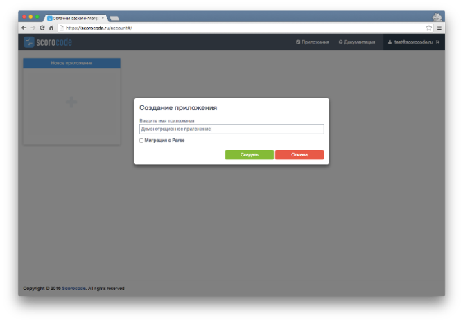
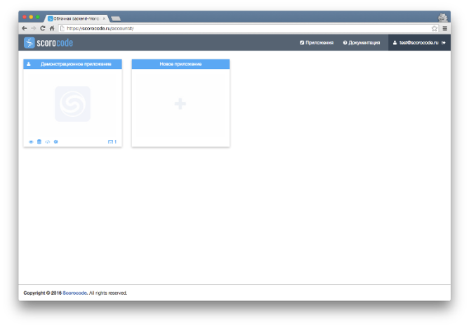

To go to the applications page, click the Applications link in the upper menu in My account. This page opens by default after you log in. This page displays widgets of previously created applications, as well as a widget for creating a new application.

To create a new application, click the mouse in the New Application widget area. Enter the name of the new application in the entry field and click Create. You can enter any characters in the application name field.

The widget for previously created applications has a name and a menu containing icons of functions:

* Analytics
* Data
* Serverside code
* Bots
* Settings

The empty application widget has the New Application name and does not have a functional menu.
