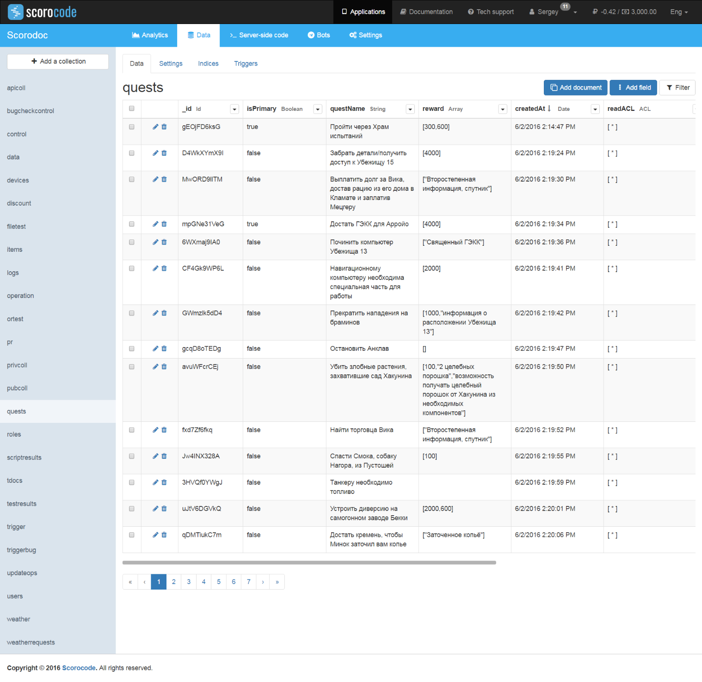
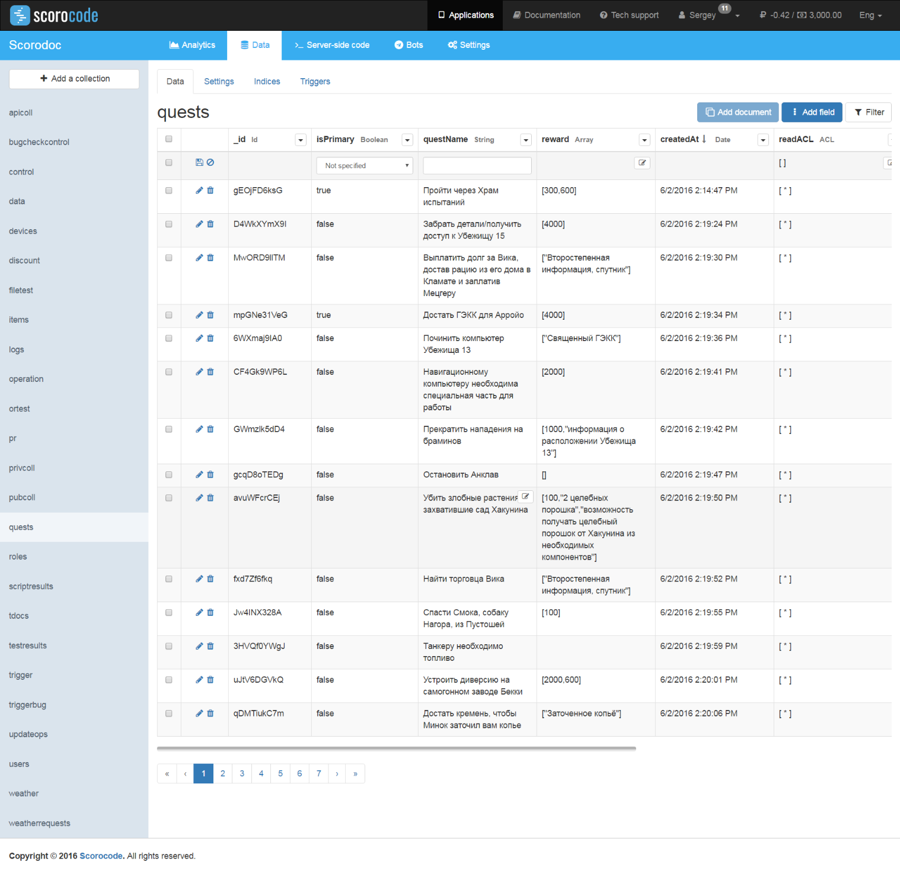
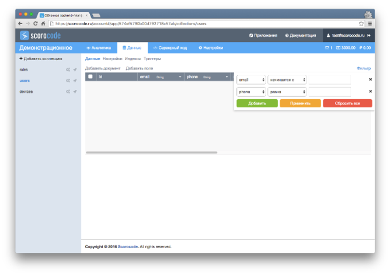
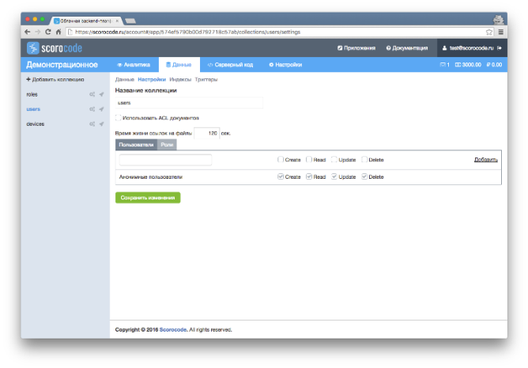

The Data functional tab contains the list of collections and a set of instruments for application collection management. The newly created application page contains 3 system collections:

* roles;
* users;
* devices.

System collections cannot be deleted. By default, the users collection of the application is selected. Each collection has the following set of management tools:

* Data
* Settings
* Indexes
* Triggers

## Collection data

By default, the Data tab is active for a selected collection.

Each collection is displayed in the form of a table with a set of fields (table columns) that contains the collection's documents. System fields that cannot be deleted are automatically created in the documents of each collection:

* id - unique document identifier
* *ACL - three ACL (access control list) type fields that define permissions to read (readACL), update (updateACL) and remove (removeACL) a document;
* createdAt – document creation date and time;
* updatedAt – date and time the document was last updated

Fields "id", "createdAt" and "updatedAt" cannot be edited; their values are automatically set by the system.

## Adding a document to a collection

To create a new document in a collection, click the Add document link. Then, click the icon of the newly created table record and save the new document. The following fields will be automatically populated in the new document: id, createdAt, and updatedAt.

## Removing a document from a collection

To remove documents from a collection, select them in the table using the checkboxes and click the Delete link. To enter a value for an editable field in the selected document, double-click in its area of the table. Enter one or several comma-separated values.

## ACL fields

ACL fields can only contain user identifier values from the users collection and role identifiers from the roles collection up to 10 characters long and an asterisk (*). Using the asterisk specifies that the function is available for all users of the users and roles collections. Use copy/paste to enter user identifiers from the users collection and role identifiers from the roles collection. ACL fields are arrays. The list values should be comma-separated (","), and each value should be enclosed in quotes, for example: ["*","0123456789"].

## Adding a field

To add a field to a document, click the Add field link.

Enter the field name (Latin letters and digits) and choose the field type from the following list:

* Date – date/time
* Boolean – true/false logical value
* String
* File
* Number
* Password – string digest using the md5 algorithm
* Array – an arbitrary data array
* Object – an object consisting of "key" pairs: <arbitrary value>
* Relation – an array of identifiers of documents from another collection
* Pointer – identifier of a document from another collection

Field names should not be the same within a single collection. To save the entered data, click the Add field button. The new field will be added to the end of the table.

## Filter

Use the Filter link to search for documents in a collection. In the popup window, choose a set of fields from the displayed list and specify a logical condition and value for the filter.

When choosing several filter condition fields, they will be combined based on the "AND" condition.

## Collection settings

To configure a collection, select it in the list and go to the Settings tab.

To use the ACL access mechanism specified in the description of a collection's document, check the "Use document ACL" field. Otherwise, ACL access of the collection's documents will be ignored.

Enter the validity period for the file links in the cloud in seconds. This parameter defines the lifetime of the generated temporary link to the file which is retrieved when calling through the API. By default, the link is valid for 120 seconds.

Enter the users and/or roles that have access rights to create, read, edit and remove a selected collection. To add users and/or roles, use the Add link and enter the user id or roles.

To grant anonymous users access to create, read, edit and remove a collection's document, select the appropriate option for the Anonymous users record.

