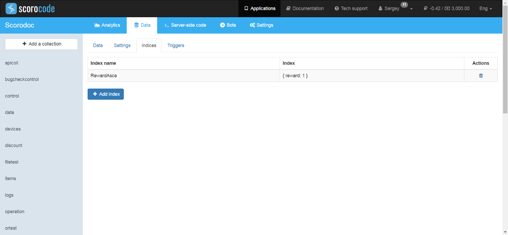
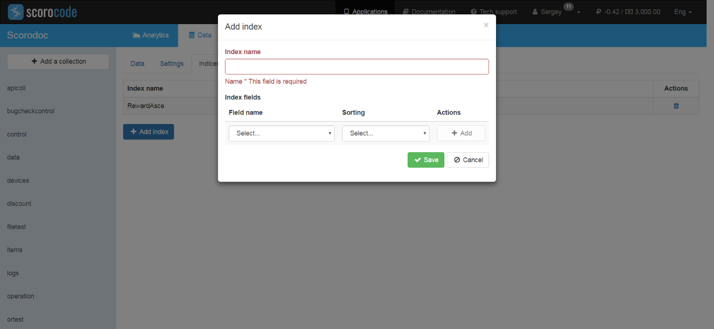

You can create indexes for collection fields in the Indexes tab. To create an index, click the Create button. In the window that appears, enter the index name (Latin letters and digits), then select the collection fields in the list. Choose how to sort the selected field (1 – ascending, -1 – descending). To create a compound index consisting of several fields, click the Add link. You can remove a field from an index by clicking the Remove link.

Once the index is saved, it will appear in the index list of the application's collection, and the index creation process will begin.

!!! warning "Data"
    Indexes considerably increase the disk space occupied by data.