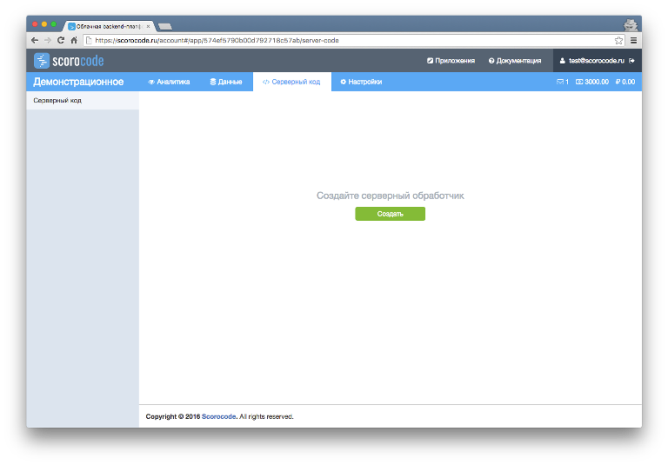

## General info

The server-side code is Java scripts executed on a server using the Google V8 engine. The developed server code is executed in accordance with a schedule (plan) or only once when called using the API method. To create a new script, click the Create button.




Enter the server code in the corresponding box. To save the entered description, click Save. To allow the script to be run by an anonymous user (without authentication), check the corresponding field in the ACL tab. To configure a plan to run the server code, go to the Plan running tab. Enable the Timer parameter to execute the created server code in accordance with the schedule. Then, define the schedule and specify the date when it will become effective.


The following schedule options are available:

* Once
* Randomly after a set time interval (days, hours, minutes)
* Daily (on set days of the week and at a set time)
* Monthly (on set months, days of month and at a set time)


The server-side code starts in a separate context and the following objects are available:

* `scorocode` – SDK scorocode, connected to the code using var scorocode = require('scorocode');
* `pool` – any object transferred when calling the script execution method via API that contains the transferred attributes.

## NPM module support

To connect third-party modules to your script, describe all existing dependencies. For this purpose, go to the Application settings section and choose the NPM dependencies item.


In the dependencies section, describe all modules that you are going to use where the attribute is a module name and the value is the required version (you can leave the version value empty; in this case, the latest module version will be installed).

Example:

```
    {
        "dependencies": {
            "scorocode": ""
        }
    }
```
   