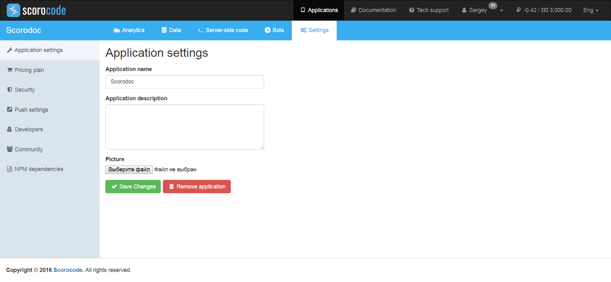
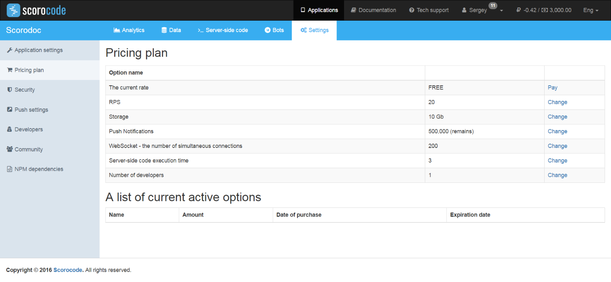
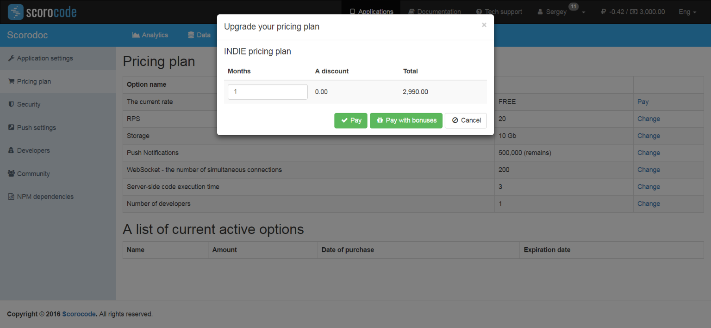
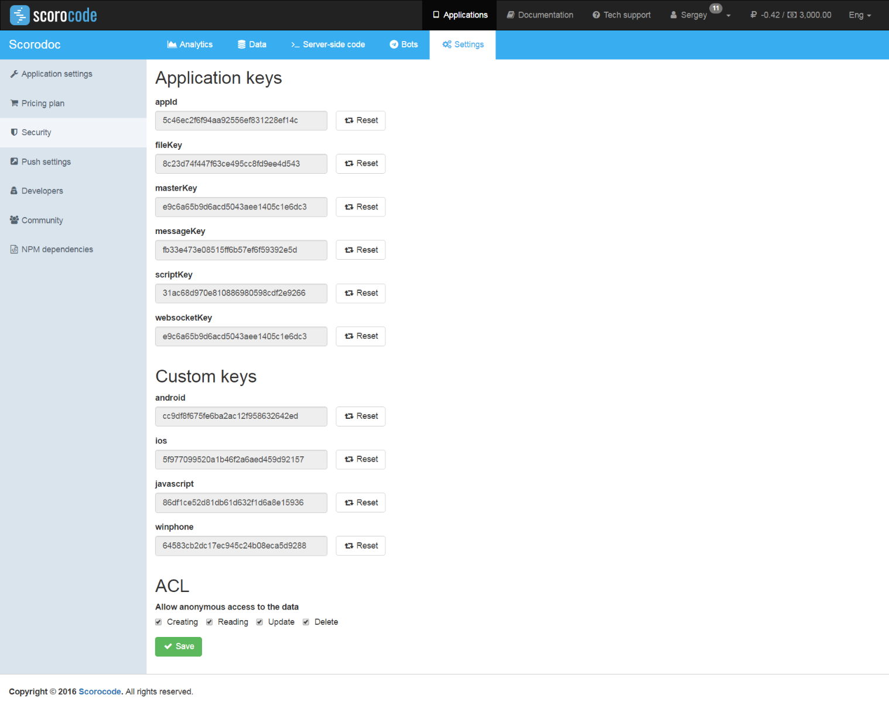
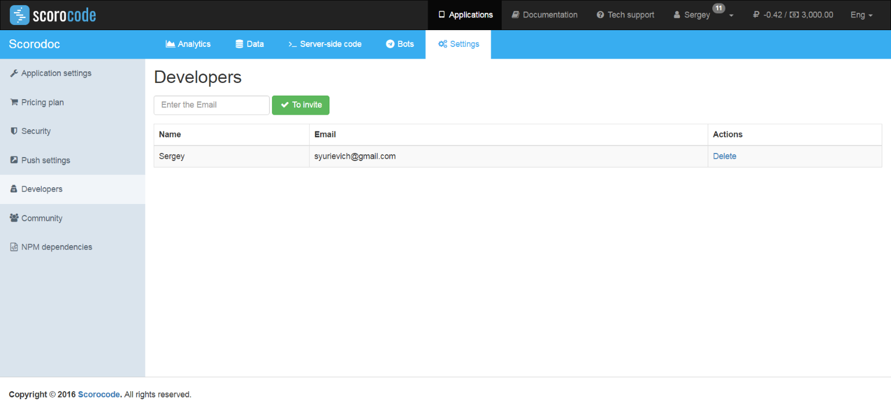
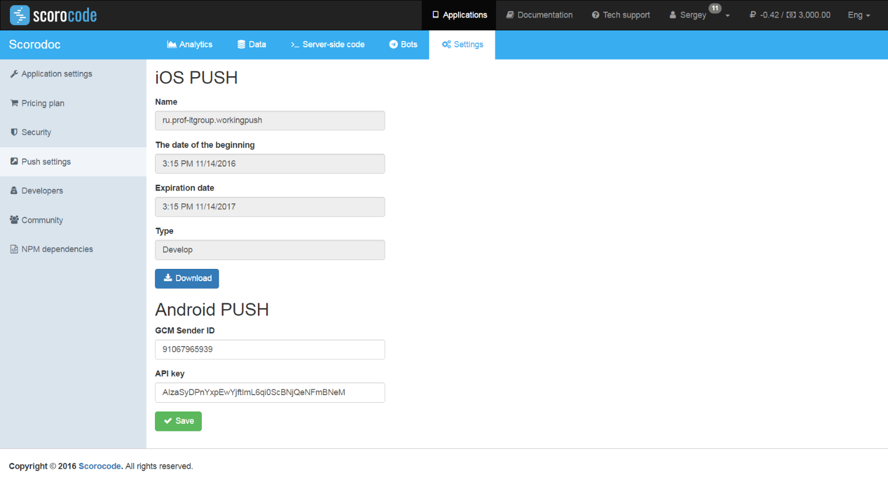
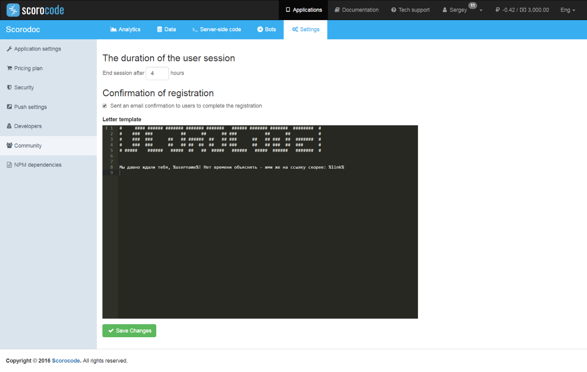

To access the application configuration options, go to the Settings functional tab. The following categories of settings are available on the Settings page:

* Application settings
* Price plan
* Security
* Developers
* Push settings
* Application user authentication

## Price plan

To set up a price plan for the application, use the Price plan link. The page that opens, shows information on the current active price plan and its activated options.

By default, the FREE price plan with the following options is activated:

* Requests per second – 20;
* Disk space – 10 GB;
* Push notifications – 500,000 (maximum);
* Developers – 1 (including the application owner).

To acquire additional options, you will need to change your price plan to INDIE. To change the price plan, use the Change link in the line with the same name.

In the pop-up window, enter how many months are required for the INDIE price plan (by default, 1). The service will calculate the price taking into account any discount. A discount is offered when a price plan/option is purchased for a period of more than 12 months. To confirm the price plan purchase, click the Purchase button.

Now you can purchase increases for the price plan option (if necessary). To do this, use the Change link in the line with the name of the required option, for example, Storage.

In the pop-up box, specify the number of months you want to purchase and the additional option size. The service will calculate the price taking into account your discount. To confirm the purchase of the additional price plan option size, click the Purchase button. The list of activated options will display information about all your purchases, with purchase dates and the dates when the settings will be deactivated.

When the purchased price plan and/or option expire, the existing restrictions will be recalculated based on the deactivation dates of all purchased add-ons to a certain price plan or option.

When all purchased option add-ons expire, its values are set to default.

When the INDIE price plan expires, the FREE price plan is activated with its option values.

## Security

Use the Security link to configure keys to access the application and public access to the application data.

The page displays the following keys:

* appID – application identifier;
* android – Android platform client key;
* javascript – JavaScript platform client key;
* iOs – iOs platform client key;
* winphone– winPhone platform client key;
* masterKey – master key of the application for full access via API;
* fileKey – key for access to API functions of the application (files);
* scriptKey – key for access to API functions of the application (scripts);
* messageKey – key for access to API functions of the application (messages);
* webSocketKey – key for access to API functions of the application (websocket).

The Reset button next to each key can be used to reset its value and generate a new key. Access to the corresponding functions using old keys will not be available after that.

To allow or prohibit public (unauthenticated) access to the application data, set ACL options for reading, writing, updating and deleting.

## Developers

Developers who have access to the application can be added using the Developers link.

Application developers can be added when the corresponding price plan is purchased, i.e. if an option is selected in the price plan for more than 1 developer.

Enter the developer's email address and click Invite. The invitation will be sent to the developer's email address.

## Push settings

This category of settings is for configuring parameters required for sending Push notifications.

### iOS Push

Click the Load certificate button to load a certificate file to the application which is required for sending PUSH notifications to iOS devices.

[Information](https://developer.apple.com/library/ios/documentation/NetworkingInternet/Conceptual/RemoteNotificationsPG/Chapters/ApplePushService.html) about Apple PUSH notifications.

### Android PUSH

Enter data in the GCM Sender ID and API key fields that is required to send PUSH notifications to Android devices.

[Information](https://developers.google.com/cloud-messaging/gcm) about Android PUSH notifications.

## Application user authentication

Use this configuration section to define a user session duration.

Click the Application user authentication link. On the page that opens, enter the duration in hours of the API session after the user logs into the application. By default, the duration of a user session is 72 hours.

You can also choose if a confirmation email should be sent to the user's email address to complete the registration process. If this option is specified, an email will be sent to the user's address after registration via API with a confirmation link to complete the registration process. Enter the text of the registration confirmation email in the text editor window.

To insert the verification link and username, insert the following values into the email text.

* `%link%` - verification link
* `%username%` - username