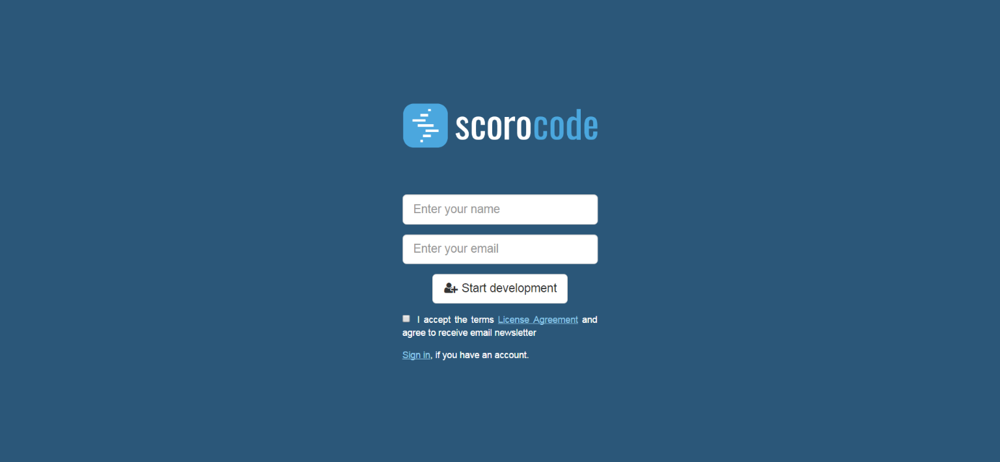

Please register to start using the Scorocode service. Enter your name and email address on the [registration page](https://scorocode.ru/account#/signup).

After successful registration, enter the developer's personal account (My account). We will send your login password by email to the address that you provided during registration. You can change the password issued by the system through the user settings section in your personal account.

To enter the platform's member area, use the Login link in the main menu on the Home page. Enter the username (email address) that you provided during registration and your password. If you enter an incorrect password three times, the system will ask you to enter captcha text. If you forget your password, click the Forgot Password link. In the next window, enter your registration email address. We will send you information on how to reset your password to this address.