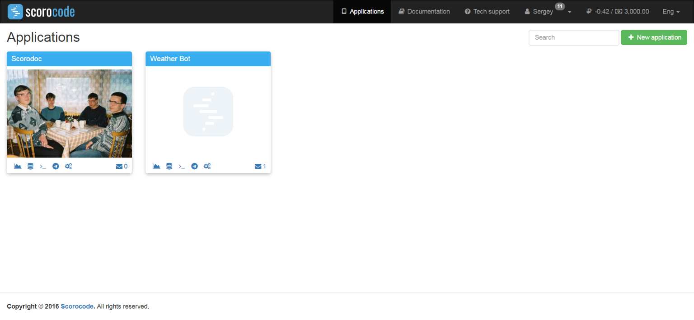
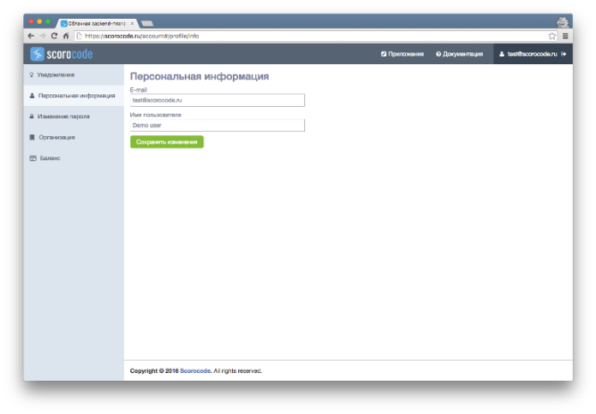
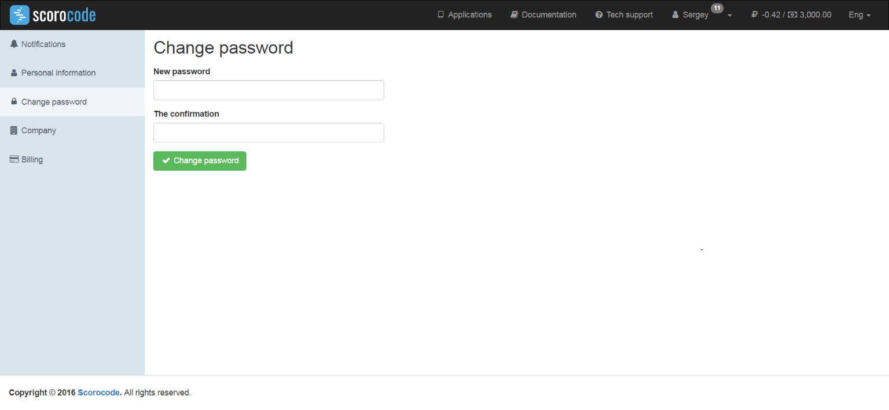
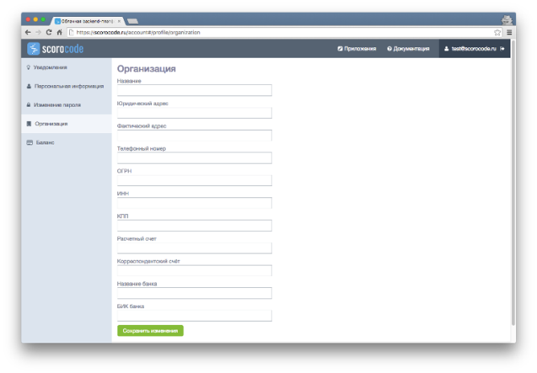
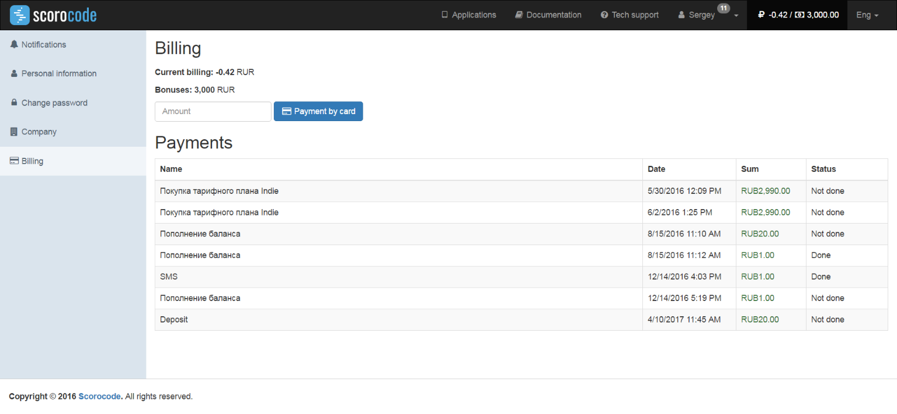

The developer's personal account contains the following sections:

* user settings and system notifications for the user;
* applications;
* documentation.

After logging in, you will see the Applications page.

## User settings and system notifications for the user

To go to the user settings and system notifications section, click the email address in the name of your personal account. The user settings and system notifications page contains the following sections:

* Notifications;
* Personal information;
* Change password;
* Organization;
* Balance.

By default, you will see the Notifications section.

## Notifications

A list of system notifications can be seen in the Notifications section of the User settings and system notifications page of your personal account. To remove a system notification, click Delete.

## Personal information

In the personal information section, you can enter (edit) your personal data: username and phone number. The email address used for your account cannot be edited.

Click Save Changes to save your changes.

## Change password

Go the Change Password section to change your password. Use this function to change the password that was generated by the system during registration.

Your new password must be at least 6 characters long. To save your new password, click the Change password button.

## Organization

Enter information about your organization in the Organization section. This information is used for preparing contracts, invoices for bank transfer payments, certificates and other accounting documents.

Click Save Changes to save the entered information.

## Balance

The Balance section contains information about your current balance, as well as the details of your receipts and expenses.

You can use the Balance section to top up your current balance with your bank card. To do this, enter the top up in Rubles and click the Pay by Card button. Enter the payment details in the form that appears. Follow the payment service instructions. You can also top up your account by bank transfer if your organization's details have been entered. Click Export to create your account statement.

